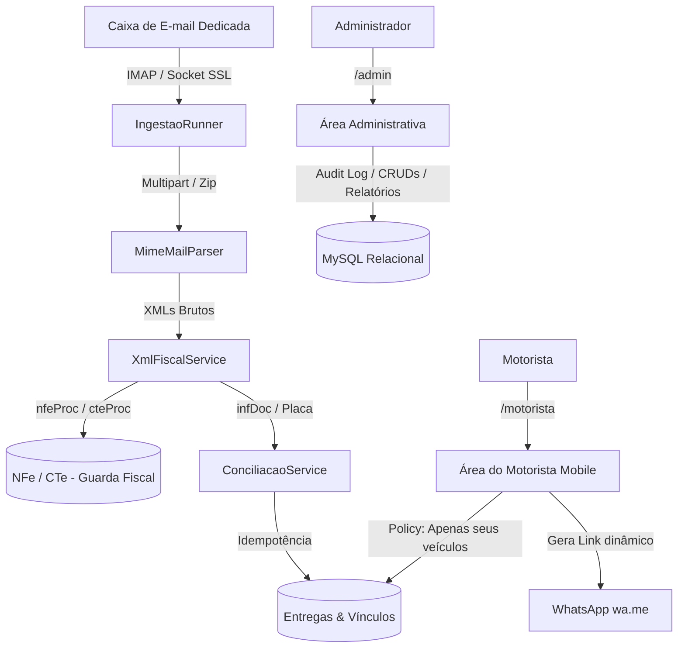
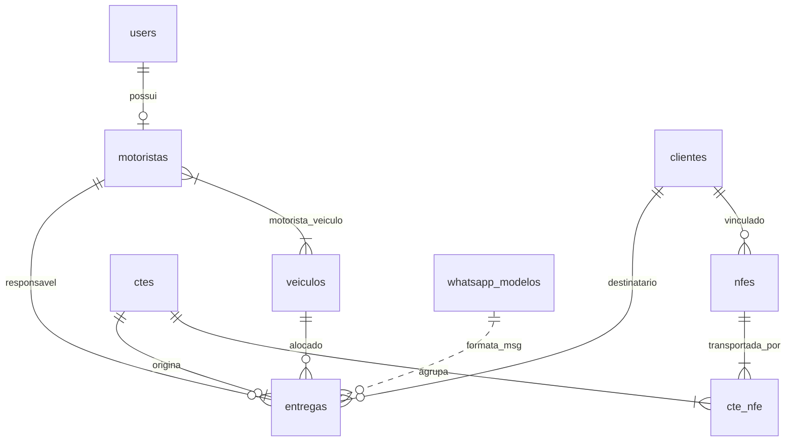

# Sistema de Conciliação de Fretes (CT-e / NF-e)

Sistema web independente para automação da recepção fiscal, conciliação NF-e ↔ CT-e ↔ veículo ↔ motorista, gestão de entregas com área do motorista (mobile first) e painel administrativo.

---

## 📌 1. Visão Geral do Projeto

O sistema foi desenvolvido para eliminar o trabalho manual em planilhas de Excel utilizado para reunir informações de fretes, gerar relatórios de operação, calcular pagamentos e disparar mensagens de acompanhamento aos clientes via WhatsApp.

### Principais Pilares
- **Ingestão Automática por E-mail**: Captura de anexos `.xml` e `.zip` via IMAP/Socket SSL.
- **Conciliação Inteligente**: Amarração N:N entre CT-e e NF-e através do bloco `infDoc`, identificação de placa e sugestão preditiva por histórico de entregas.
- **Separação Rígida de Áreas**:
  - `/admin`: Dashboard, CRUDs, gestão de documentos, pendências, auditoria e relatórios exportáveis.
  - `/motorista`: Interface tátil *mobile first* com cartões de entrega, transição rápida de status e atalho WhatsApp (`wa.me`) parametrizado.
- **Instalação e Manutenção Zero-SSH**: Painel web de configuração de banco MySQL e e-mail, além de auto-migrações seguras com lock.
- **Arquitetura Leve**: Laravel com views Blade, CSS e JS nativos (sem necessidade de Node/Vite/build complexo).

---

## 🏗️ 2. Arquitetura e Padrões de Projeto



### Padrões de Projeto (Design Patterns)
1. **Service Layer Pattern**:
   - `App\Services\XmlFiscalService`: Parsing, validação e persistência estruturada de XMLs fiscais e eventos de cancelamento.
   - `App\Services\ConciliacaoService`: Orquestração de regras de negócio, vínculo N:N entre documentos fiscais e alocação de veículos.
   - `App\Services\ImapMailboxService`: Camada de comunicação IMAP com fallback resiliente para sockets SSL nativos.
   - `App\Services\IngestaoRunner`: Ponto central de execução do fluxo de captura, compartilhado entre CLI (`artisan`) e interface web.
2. **Policy Pattern**:
   - `App\Policies\EntregaPolicy`: Garantia de isolamento de dados no backend, permitindo ao motorista visualizar apenas entregas dos seus veículos vinculados.
3. **Pipeline & Middleware Chain**:
   - `EnsureProfile`: Proteção de rotas `/admin` e `/motorista`.
   - `AuditAdminAction`: Registro automatizado de auditoria para mutações administrativas.
   - `SecurityHeaders` & `ForceHttps`: Blindagem de cabeçalhos HTTP e reforço de HTTPS.
4. **Placeholder / Template Pattern**:
   - `App\Models\WhatsappModelo`: Interpolação dinâmica de tags `{cliente}`, `{nfe}`, `{placa}`, `{status}` e `{motorista}`.
5. **Idempotency Pattern**:
   - Chave de acesso de 44 dígitos como chave única e controle de `message_id` dos e-mails processados para prevenir duplicidades.

---

## 📊 3. Status de Implementação das Fases

### ✅ O Que Já Está Construído e Funcional

| Fase | Módulo | Recursos Entregues |
| :---: | :--- | :--- |
| **1** | **Base & Segurança** | • Projeto Laravel estruturado sem dependência de build.<br>• Instalador web e auto-migração (`AutoInstall`, `SharedHostingInstaller`).<br>• Painel de configuração de MySQL e E-mail via Web UI.<br>• Autenticação com rate limiting (10 req/min) e perfis (Admin e Motorista).<br>• Middleware de auditoria de ações do administrador. |
| **2** | **Cadastros** | • CRUD de Veículos (com suporte a atributos extras em JSON).<br>• CRUD de Motoristas com vínculo N:N a veículos.<br>• CRUD de Clientes / Contatos de entrega.<br>• CRUD de Usuários do sistema.<br>• Gestão de Modelos de Mensagem de WhatsApp. |
| **3** | **Ingestão & Conciliação** | • Leitura de e-mail IMAP com suporte a anexos `.xml` e `.zip`.<br>• Identificação automática de `nfeProc`, `cteProc` e cancelamentos.<br>• Guarda fiscal obrigatória do XML integral.<br>• Conciliação automática de CT-e com NF-e via `infDoc`.<br>• Identificação de placa e sugestão preditiva por histórico.<br>• Painel de pendências e erros de ingestão. |
| **4** | **Entregas & Motorista** | • Geração automática de entregas a partir do CT-e/NF-e.<br>• Interface móvel dedicada para motoristas (Mobile First).<br>• Botões de status rápido: "Saí para entrega", "Entregue" e "Ocorrência".<br>• Botão de WhatsApp com mensagem parametrizada e link direto `wa.me`. |
| **5** | **Relatórios & Consultas** | • Consulta e listagem de CT-e e NF-e com busca por chave, número e placa.<br>• Visualizador formatado do XML fiscal bruto.<br>• Atribuição manual de veículo para CT-e sem placa informada.<br>• Relatório geral com filtros de período e status.<br>• Exportação nativa em CSV com BOM UTF-8 (compatível com Excel).<br>• Agendador via `php artisan schedule:run` e webhook protegido `/run-cron`. |

---

### ⏳ O Que Falta Construir (Backlog e Fases Futuras)

| Fase | Módulo | Descrição do Escopo a Construir |
| :---: | :--- | :--- |
| **6** | **Módulo Financeiro** | • Tabela de precificação de frete para agregados (por km, peso, cubagem ou % do frete).<br>• Lançamento de adiantamentos, pedágio, abastecimento e descontos.<br>• Fechamento de lotes de pagamento e emissão de extrato/recibo do motorista. |
| **7** | **Controle de Estoque** | • Cadastro de armazéns, docas e posições de estoque.<br>• Registro de conferência física na descarga das mercadorias.<br>• Controle de transbordo (cross-docking) e reembarque. |
| **Evolução** | **PWA & Offline** | • Configuração de `manifest.json` e Service Worker para permitir a instalação do app na tela inicial do celular do motorista. |
| **Evolução** | **Canhoto Digital** | • Captura de foto do canhoto assinado pela câmera do smartphone com anexo à entrega. |
| **Evolução** | **SEFAZ Distribuição DF-e**| • Consulta automática direta ao WebService da SEFAZ via Certificado Digital A1. |
| **Evolução** | **Integração Ravex API** | • Sincronização automática de dados de telemetria, rastreamento e jornada. |
| **Evolução** | **WhatsApp API Oficial** | • Disparo automático de notificações em segundo plano via API Oficial (Meta Cloud API). |

---

## 🗄️ 4. Modelo de Dados (Dicionário de Tabelas)



### Principais Tabelas
- `users`: Usuários do sistema (`admin` ou `motorista`).
- `motoristas`: Dados do motorista, CNH, tipo de contrato (próprio/agregado) e vínculo com `user_id`.
- `veiculos`: Frota cadastrada pela placa (única), modelo, tipo e dados extras (`extras` JSON).
- `motorista_veiculo`: Tabela pivot N:N entre motoristas e veículos.
- `clientes`: Cadastro de destinatários, remetentes e telefones de WhatsApp.
- `nfes`: Notas fiscais com chave de acesso de 44 dígitos, valores, volumes, peso e XML bruto.
- `ctes`: Conhecimentos de transporte com frete, tomador, placa informada e XML bruto.
- `cte_nfe`: Tabela pivot N:N relacionando CT-es com as NF-es transportadas.
- `entregas`: Entregas geradas, com status (`a_coleter`, `em_transito`, `entregue`, `ocorrencia`), motorista, veículo e horários.
- `email_ingestoes`: Log de auditoria da leitura de e-mails (`processado`, `erro`, `duplicado`).
- `whatsapp_modelos`: Templates parametrizáveis de mensagens por gatilho de status.
- `auditoria_logs`: Histórico de operações efetuadas pelos administradores.
- `configuracoes`: Armazenamento de parâmetros do sistema (banco, IMAP).

---

## 🚀 5. Instruções de Instalação e Execução

### Requisitos
- PHP 8.2 ou superior (com extensões `pdo_mysql`, `simplexml`, `mbstring`, `openssl`).
- Banco de Dados MySQL 8.0+ ou MariaDB 10.4+.
- Servidor Web (Apache / Nginx) ou `php artisan serve`.

### Primeiro Acesso
1. Aponte o Document Root do seu servidor web para a pasta `public/`.
2. Acesse a aplicação no navegador (ex.: `http://localhost/` ou `http://seu-dominio.com/`).
3. O instalador automático criará a estrutura inicial de banco e o usuário administrador padrão:
   - **E-mail**: `admin@fretes.local`
   - **Senha**: `admin123`
4. Acesse **⚙️ Configurações** no menu administrativo para configurar o banco de dados MySQL definitivo e a caixa de e-mail de ingestão.

### Agendamento da Ingestão
Adicione o agendador ao cron do servidor:
```bash
* * * * * php /caminho/do/projeto/artisan schedule:run >> /dev/null 2>&1
```
*Ou, em hospedagens compartilhadas sem acesso ao terminal, configure um serviço de monitoramento (ex.: Cron-Job.org) chamando:*
`https://seu-dominio.com/run-cron?token=SEU_CRON_TOKEN`
