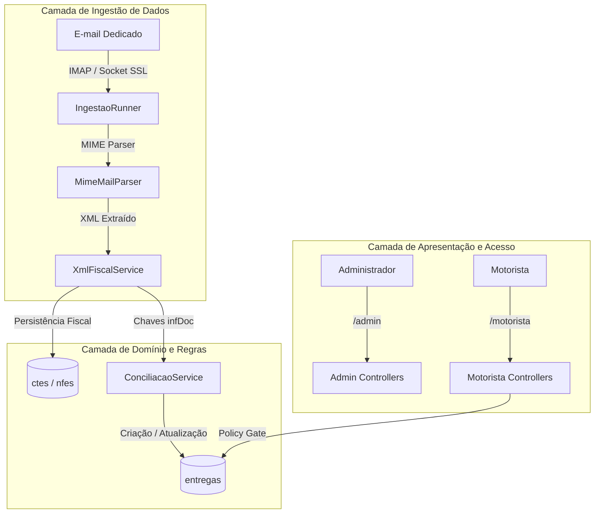

# 01 - Arquitetura e Padrões de Projeto

## 1. Princípios Arquiteturais

O sistema foi desenhado para ser leve, rápido e resiliente, operando sem dependências de compilação em tempo de execução (*Node/Vite/npm*).

- **Backend**: Laravel 11/12 em PHP 8.2+ como motor de regras de negócio e API.
- **Frontend**: PHP puro renderizado no servidor via Blade com Vanilla CSS e JavaScript modular nativo.
- **Ambiente de Hospedagem**: Compatível tanto com servidores dedicados/VPS quanto com hospedagens compartilhadas (cPanel) sem SSH.
- **Processamento Assíncrono**: Fila via driver `database` e agendador via cron CLI ou webhook HTTP `/run-cron`.

---

## 2. Diagrama de Arquitetura

---

## 3. Padrões de Projeto (Design Patterns)

### 3.1. Service Layer Pattern
Encapsula operações complexas fora dos controladores HTTP:
- [`XmlFiscalService`](file:///c:/levitico/app/Services/XmlFiscalService.php): Responsável pelo parse e tratamento dos documentos eletrônicos.
- [`ConciliacaoService`](file:///c:/levitico/app/Services/ConciliacaoService.php): Responsável pela amarração entre documentos fiscais e alocação operacional.
- [`ImapMailboxService`](file:///c:/levitico/app/Services/ImapMailboxService.php): Responsável pela comunicação com o servidor de correio.
- [`IngestaoRunner`](file:///c:/levitico/app/Services/IngestaoRunner.php): Responsável pela orquestração do lote de e-mails.

### 3.2. Policy Pattern (Autorização em Camada de Domínio)
- [`EntregaPolicy`](file:///c:/levitico/app/Policies/EntregaPolicy.php): Assegura que o motorista autenticado só consiga visualizar e alterar o status de entregas cujos veículos pertençam a ele (`$motorista->veiculos`).

### 3.3. Middleware Chain (Pipeline de Requisições)
- [`EnsureProfile`](file:///c:/levitico/app/Http/Middleware/EnsureProfile.php): Validação de perfil (`admin` vs `motorista`).
- [`AuditAdminAction`](file:///c:/levitico/app/Http/Middleware/AuditAdminAction.php): Rastreamento automático de mutações (POST, PUT, DELETE) com gravação de IP e payload.
- [`ForceHttps`](file:///c:/levitico/app/Http/Middleware/ForceHttps.php) e [`SecurityHeaders`](file:///c:/levitico/app/Http/Middleware/SecurityHeaders.php): Blindagem de segurança HTTP.

### 3.4. Adapter & Fallback Pattern
- `ImapMailboxService` suporta conexões usando a extensão PHP IMAP (`imap_open`) ou sockets SSL manuais (`fsockopen`/`stream_socket_client`) para operar mesmo quando a extensão não está compilada no PHP.

### 3.5. Idempotency Pattern
- Garantida pela unicidade da chave de acesso de 44 dígitos no banco de dados (`chave_acesso UNIQUE`) e controle de `message_id` dos e-mails.
