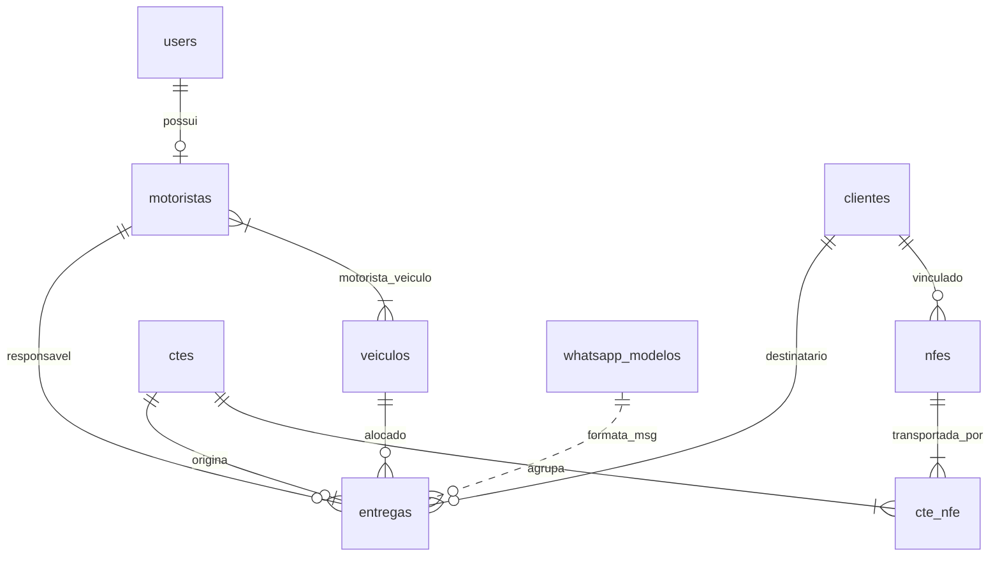

# 02 - Banco de Dados e Modelagem

## 1. Diretrizes de Banco de Dados

- **SGBD Padrão**: MySQL / MariaDB (InnoDB, `utf8mb4`). Suporte automático a SQLite para instâncias de testes ou instalação inicial transparente.
- **Índices Principais**: Índices únicos em chaves fiscais de 44 dígitos (`chave_acesso`), placas de veículos e Message-IDs.
- **Regra de Migrações**: Apenas migrations aditivas (inclusão de tabelas e colunas com valores default ou nulos) para evitar quebras em produção.

---

## 2. Diagrama Entidade-Relacionamento (DER)

---

## 3. Dicionário de Dados

### `users`
Armazena as credenciais e o perfil do usuário no sistema.
- `id` (BIGINT, PK)
- `name` (VARCHAR)
- `email` (VARCHAR, UNIQUE)
- `password` (VARCHAR)
- `profile` (VARCHAR: `admin`, `motorista`)

### `veiculos`
Cadastro da frota de veículos vinculada às entregas.
- `id` (BIGINT, PK)
- `placa` (VARCHAR(10), UNIQUE)
- `tipo` (VARCHAR, NULL) - *Truck, Carreta, Toco, VUC, etc.*
- `marca` (VARCHAR, NULL)
- `modelo` (VARCHAR, NULL)
- `renavam` (VARCHAR, NULL)
- `extras` (JSON, NULL) - *Extensões futuras sem migração estrutural*
- `ativo` (BOOLEAN, DEFAULT true)

### `motoristas`
Cadastro dos condutores e agregados.
- `id` (BIGINT, PK)
- `user_id` (BIGINT, FK -> users, NULL)
- `nome` (VARCHAR)
- `cnh` (VARCHAR, NULL)
- `telefone` (VARCHAR(30), NULL)
- `agregado` (BOOLEAN, DEFAULT false)
- `extras` (JSON, NULL)

### `motorista_veiculo` (Pivot N:N)
Relação entre condutores e os veículos que eles podem operar.
- `id` (BIGINT, PK)
- `motorista_id` (BIGINT, FK -> motoristas)
- `veiculo_id` (BIGINT, FK -> veiculos)
- *Índice único*: `(motorista_id, veiculo_id)`

### `clientes`
Destinatários e remetentes com contato telefônico para o WhatsApp.
- `id` (BIGINT, PK)
- `nome` (VARCHAR)
- `documento` (VARCHAR(25), NULL) - *CNPJ/CPF*
- `telefone` (VARCHAR(30), NULL)
- `whatsapp` (VARCHAR(30), NULL)
- `endereco`, `cidade`, `uf`, `cep` (VARCHAR)

### `nfes`
Notas Fiscais Eletrônicas capturadas.
- `id` (BIGINT, PK)
- `chave_acesso` (CHAR(44), UNIQUE)
- `numero`, `serie`, `emissao`
- `emitente_nome`, `emitente_cnpj`
- `destinatario_nome`, `destinatario_documento`, `destinatario_telefone`
- `destinatario_endereco`, `destinatario_cidade`, `destinatario_uf`
- `valor_total` (DECIMAL(14,2))
- `volumes` (INT), `peso_bruto` (DECIMAL(14,3))
- `xml_original` (LONGTEXT) - *Guarda fiscal obrigatória*
- `cancelada` (BOOLEAN, DEFAULT false)
- `cliente_id` (BIGINT, FK -> clientes, NULL)

### `ctes`
Conhecimentos de Transporte Eletrônico.
- `id` (BIGINT, PK)
- `chave_acesso` (CHAR(44), UNIQUE)
- `numero`, `serie`, `emissao`
- `tomador_nome`, `remetente_nome`, `destinatario_nome`
- `valor_frete` (DECIMAL(14,2))
- `placa_informada` (VARCHAR(10), NULL)
- `xml_original` (LONGTEXT)
- `cancelado` (BOOLEAN, DEFAULT false)

### `cte_nfe` (Pivot N:N)
Vinculação entre o CT-e e as Notas Fiscais transportadas.
- `id` (BIGINT, PK)
- `cte_id` (BIGINT, FK -> ctes)
- `nfe_id` (BIGINT, FK -> nfes)
- *Índice único*: `(cte_id, nfe_id)`

### `entregas`
Registro operacional de execução da viagem/entrega.
- `id` (BIGINT, PK)
- `cte_id` (BIGINT, FK -> ctes, NULL)
- `veiculo_id` (BIGINT, FK -> veiculos, NULL)
- `motorista_id` (BIGINT, FK -> motoristas, NULL)
- `cliente_id` (BIGINT, FK -> clientes, NULL)
- `status` (VARCHAR(20): `a_coleter`, `em_transito`, `entregue`, `ocorrencia`)
- `endereco_entrega`, `cidade_entrega`, `uf_entrega`
- `observacao_ocorrencia` (TEXT, NULL)
- `comprovante_path` (VARCHAR, NULL) - *Caminho da foto do canhoto digital no storage*
- `comprovante_enviado_em` (TIMESTAMP, NULL)
- `saiu_em` (TIMESTAMP, NULL)
- `entregue_em` (TIMESTAMP, NULL)

### `email_ingestoes`
Auditoria da leitura periódica de mensagens na caixa de e-mail.
- `id` (BIGINT, PK)
- `message_id` (VARCHAR, INDEX)
- `assunto`, `remetente`
- `lido_em` (TIMESTAMP)
- `status` (`processado`, `erro`, `duplicado`)
- `detalhes` (TEXT)

### `whatsapp_modelos`
Templates de mensagens disparáveis pelo motorista ou painel.
- `id` (BIGINT, PK)
- `nome` (VARCHAR)
- `gatilho` (VARCHAR: `em_transito`, `entregue`, `ocorrencia`, `manual`)
- `template` (TEXT) - *Tags suportadas: {cliente}, {nfe}, {placa}, {status}, {motorista}*
- `ativo` (BOOLEAN, DEFAULT true)

### `auditoria_logs`
Rastreamento de segurança das operações administrativas.
- `id` (BIGINT, PK)
- `user_id` (BIGINT, FK -> users, NULL)
- `acao`, `modelo`, `registro_id`
- `payload` (JSON, NULL)
- `ip` (VARCHAR(45))
