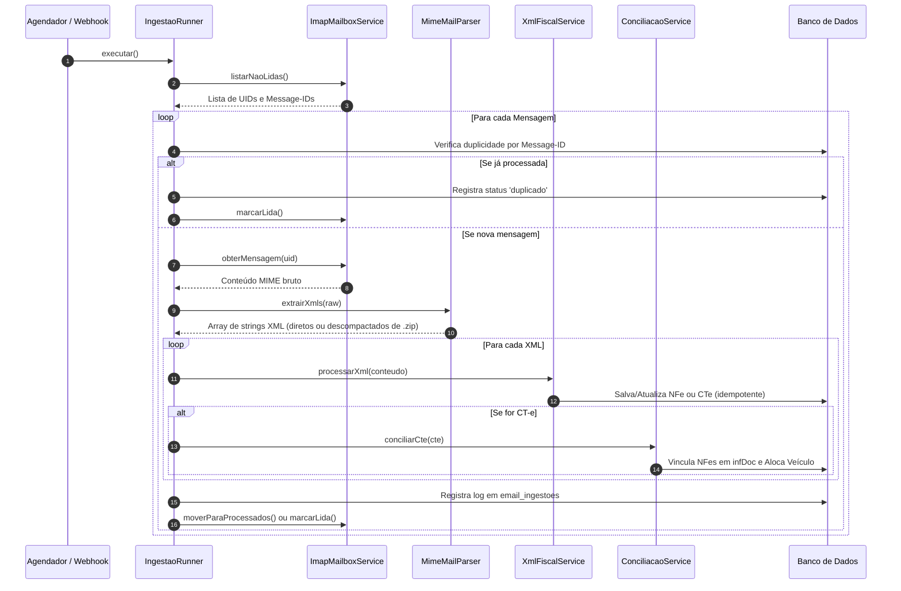

# 03 - Fluxos de Ingestão e Conciliação

## 1. Fluxo de Leitura e Ingestão de E-mails

A leitura ocorre a cada 1 ou 2 minutos via cron agendado ou acionamento manual no painel.



---

## 2. Regras de Conciliação e Amarração Operacional

A classe [`ConciliacaoService`](file:///c:/levitico/app/Services/ConciliacaoService.php) executa a conciliação através de 4 etapas estruturadas:

1. **Leitura das NF-es no CT-e**:
   - Varre a tag `<infDoc>` do XML do CT-e procurando por nós `<infNFe Chave="...">`.
   - Busca no banco local pelas NF-es correspondentes e cria o vínculo N:N na tabela `cte_nfe`.
   - Caso alguma NF-e referenciada ainda não tenha chegado na caixa de e-mail, gera uma pendência não-bloqueante no painel admin.

2. **Identificação do Veículo**:
   - Extrai a placa do modal rodoviário (`infModal -> rodo -> veicTran -> veiculo -> placa`).
   - Se presente e cadastrada na tabela `veiculos`, associa imediatamente à entrega.
   - Se não presente no XML ou não cadastrada, dispara o algoritmo de **Sugestão Preditiva por Histórico** (busca o veículo mais recente que transportou NF-es do mesmo tomador/destinatário) e sinaliza no painel de pendências para validação do administrador.

3. **Criação da Entrega**:
   - Executa `Entrega::firstOrNew(['cte_id' => $cte->id])` garantindo idempotência.
   - Herda endereço, cidade e UF de entrega prioritariamente da NF-e ou do CT-e.

4. **Identificação do Cliente / Contato**:
   - Localiza o cliente cadastrado pelo CPF/CNPJ do destinatário da NF-e para vincular telefones e número de WhatsApp.

---

## 3. Disparo de WhatsApp na Área do Motorista

1. O motorista acessa a entrega atribuída ao seu veículo em `/motorista/entregas/{id}`.
2. O sistema recupera o modelo ativo de WhatsApp correspondente ao status da entrega (`whatsapp_modelos`).
3. O método `WhatsappModelo::renderizar($entrega)` substitui as tags:
   - `{cliente}`: Nome do destinatário da entrega.
   - `{nfe}`: Número(s) da(s) NF-e(s).
   - `{placa}`: Placa do veículo.
   - `{status}`: Descrição amigável do status atual.
   - `{motorista}`: Nome do motorista condutor.
4. O app gera a URL padrão:
   ```
   https://wa.me/5511999999999?text=Ol%C3%A1%20...
   ```
5. Ao tocar no botão, o aplicativo do WhatsApp é aberto no dispositivo com a mensagem já pronta para envio, sem custos de API e sem necessidade de cadastro em mensageria corporativa.
