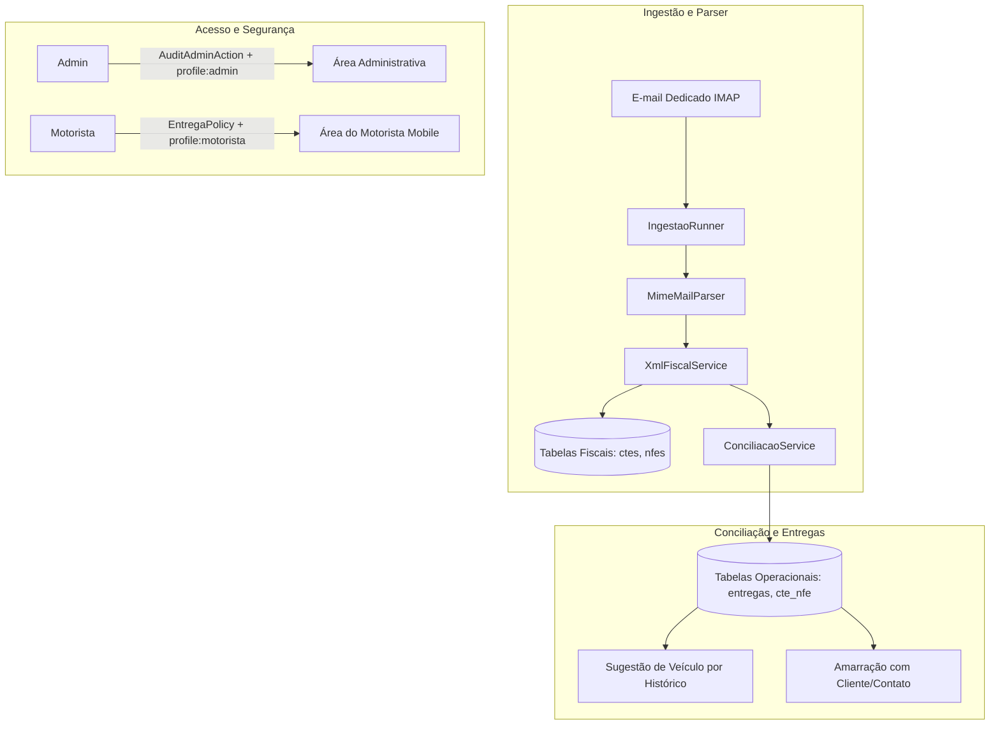

# Documentação de Arquitetura e Engenharia de Software

## Sistema de Conciliação de Fretes (CT-e / NF-e)

Este documento descreve detalhadamente a arquitetura, padrões de projeto, modelo de dados, fluxos de execução e o status de entrega do projeto.

---

## 1. Arquitetura do Sistema

O sistema é construído sobre o ecossistema **PHP / Laravel** utilizando renderização no servidor com **Blade**, sem dependências de compilação de assets em tempo de execução (Vite/Node/npm), permitindo fácil deploy e manutenção.



---

## 2. Padrões de Projeto (Design Patterns) Aplicados

| Padrão | Onde foi aplicado | Descrição |
| :--- | :--- | :--- |
| **Service Layer** | `App\Services\` | Encapsula as regras de parsing (`XmlFiscalService`), conciliação (`ConciliacaoService`), conexão IMAP (`ImapMailboxService`) e execução de ingestão (`IngestaoRunner`). |
| **Policy / Gate** | `App\Policies\EntregaPolicy` | Garante que o motorista só acesse entregas dos seus próprios veículos em nível de regra de negócio no backend. |
| **Chain of Responsibility** | `App\Http\Middleware\` | Pipeline de requisições com `EnsureProfile`, `AuditAdminAction`, `ForceHttps` e `SecurityHeaders`. |
| **Idempotency** | Ingestão e Models | Prevenção de duplicidade por chave de acesso única de 44 dígitos (`chave_acesso`) e Message-ID de e-mails (`email_ingestoes`). |
| **Template Method / Interpolation** | `App\Models\WhatsappModelo` | Renderizador dinâmico de texto substituindo variáveis de entrega (`{cliente}`, `{nfe}`, `{placa}`, `{status}`, `{motorista}`). |
| **Adapter / Fallback** | `ImapMailboxService` | Conexão com servidores de e-mail via extensão nativa `php-imap` ou via Sockets SSL manuais caso a extensão esteja ausente. |

---

## 3. Matriz de Fases: O que já temos construído vs. O que falta

### ✅ Módulos Já Construídos (Fases 1 a 5)

1. **Fase 1: Base e Infraestrutura**
   - Instalador web transparente para hospedagens compartilhadas (`SharedHostingInstaller`, `AutoInstall`).
   - Painel web em `ConfiguracoesController` para configurar banco MySQL e conexão IMAP sem tocar no terminal/SSH.
   - Autenticação por perfis (`admin` e `motorista`), rate limit de 10 tentativas/min e log de auditoria (`auditoria_logs`).

2. **Fase 2: Cadastros**
   - CRUD de Veículos com placa única e campo JSON flexível (`extras`).
   - CRUD de Motoristas com vínculo N:N a múltiplos veículos.
   - CRUD de Clientes / Contatos para mapeamento de número de WhatsApp.
   - CRUD de Usuários do sistema.
   - Gestão de Modelos de Mensagem do WhatsApp com tags dinâmicas.

3. **Fase 3: Ingestão e Conciliação**
   - Leitura de e-mails IMAP e descompactação de anexos `.xml` e `.zip`.
   - Parser de `nfeProc`, `cteProc` e cancelamentos (`procInutl` / eventos).
   - Guarda fiscal completa do XML original no banco de dados.
   - Conciliação N:N de NF-es para cada CT-e através das chaves de acesso em `infDoc`.
   - Identificação de placa e algoritmo de sugestão de veículo baseado em histórico de entregas anteriores.
   - Painel de pendências para e-mails com erro e CT-es sem veículo atribuído.

4. **Fase 4: Operação de Entregas e Área do Motorista**
   - Geração automática do registro de entrega a partir dos documentos fiscais.
   - Área do motorista otimizada para dispositivos móveis (*Mobile First*).
   - Botões rápidos de atualização de status ("Saí para entrega", "Entregue", "Ocorrência") com timestamps e observação.
   - Botão para envio de WhatsApp com mensagem renderizada e link direto `wa.me`.

5. **Fase 5: Consultas e Relatórios**
   - Listagem de CT-e e NF-e com visualizador do XML bruto e atribuição manual de veículo.
   - Relatórios com filtros por período e status, exportáveis em formato CSV formatado para Excel (BOM UTF-8).
   - Gatilho do cron via agendador do Laravel e webhook `/run-cron` com token de segurança.

---

### ⏳ Módulos a Construir (Fases 6, 7 e Evoluções)

1. **Fase 6: Módulo Financeiro & Pagamento de Agregados**
   - [ ] Tabela de regras de precificação de frete (por km rodado, faixa de peso, cubagem ou % sobre frete).
   - [ ] Lançamento de adiantamentos de viagem, pedágio e descontos operacionais.
   - [ ] Fechamento periódico de lotes de pagamento de agregados com extrato detalhado.

2. **Fase 7: Controle de Estoque / Cross-Docking**
   - [ ] Cadastro de armazéns, docas e posições de estoque.
   - [ ] Conferência física na descarga das mercadorias transportadas pelas NF-es.
   - [ ] Controle de estoque de transbordo e reembarque.

3. **Evoluções Futuras**
   - [ ] **PWA**: Adição de `manifest.json` e Service Worker para permitir a instalação do app no smartphone do motorista.
   - [ ] **Comprovante Digital (Canhoto)**: Captura de foto do canhoto assinado via câmera do celular diretamente na tela de entrega.
   - [ ] **SEFAZ Distribuição DF-e**: Consulta direta ao WebService da SEFAZ via Certificado A1.
   - [ ] **Integração Ravex API**: Sincronização automática de telemetria, rastreamento e jornada do motorista.
   - [ ] **WhatsApp API Oficial**: Disparo automático de mensagens em segundo plano disparadas por eventos de status.

---

## 4. Estrutura de Diretórios Relevantes

```
levitico/
├── app/
│   ├── Console/Commands/
│   │   └── IngestaoEmailCommand.php     # Comando artisan fretes:ingestao-email
│   ├── Http/
│   │   ├── Controllers/
│   │   │   ├── Admin/                   # Controladores da área administrativa
│   │   │   ├── Motorista/               # Controladores da área do motorista
│   │   │   └── Auth/                    # Autenticação e login
│   │   └── Middleware/                  # RBAC, Auditoria, HTTPS, Headers
│   ├── Models/                          # Eloquent Models (Nfe, Cte, Entrega, etc.)
│   ├── Policies/                        # Políticas de autorização (EntregaPolicy)
│   ├── Services/                        # Serviços de ingestão, XML e conciliação
│   └── Support/                         # Auto-instalador e configurador de banco
├── database/migrations/                 # Estrutura do banco de dados relacional
├── resources/views/
│   ├── admin/                           # Telas do painel administrativo
│   ├── motorista/                       # Telas mobile da área do motorista
│   └── layouts/app.blade.php            # Layout base responsivo
└── routes/web.php                       # Definição de rotas e webhooks
```
